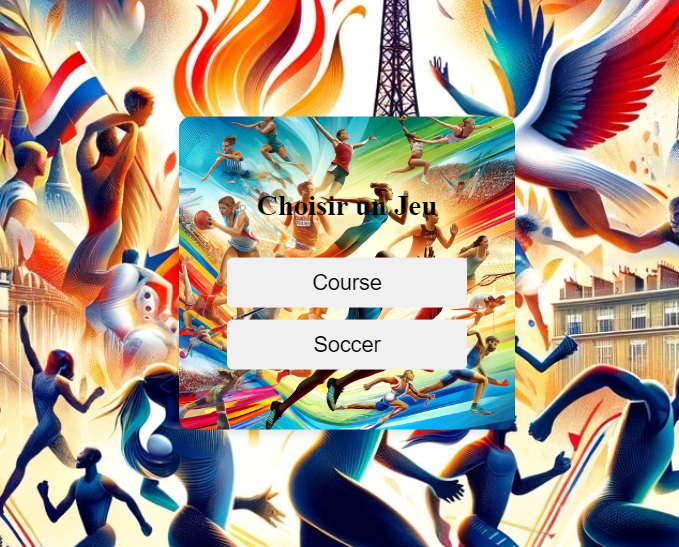
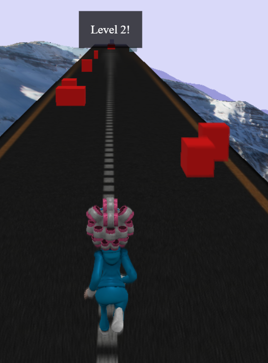
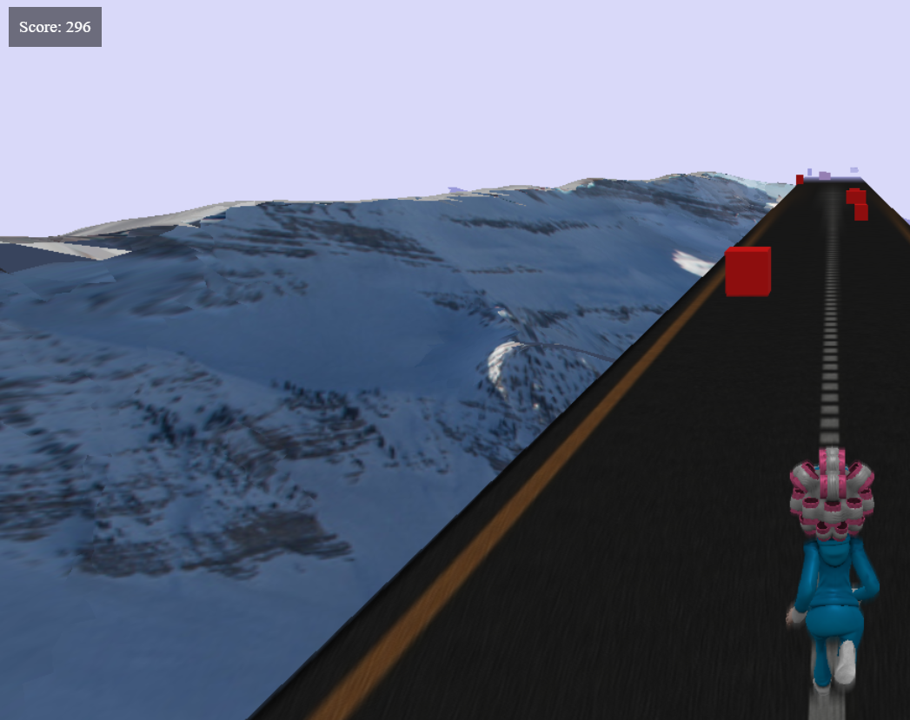
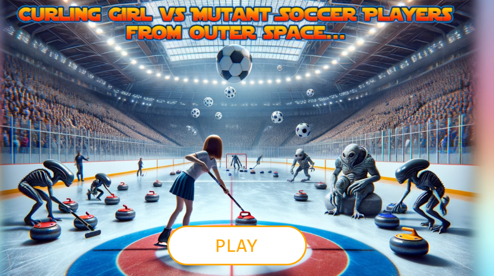
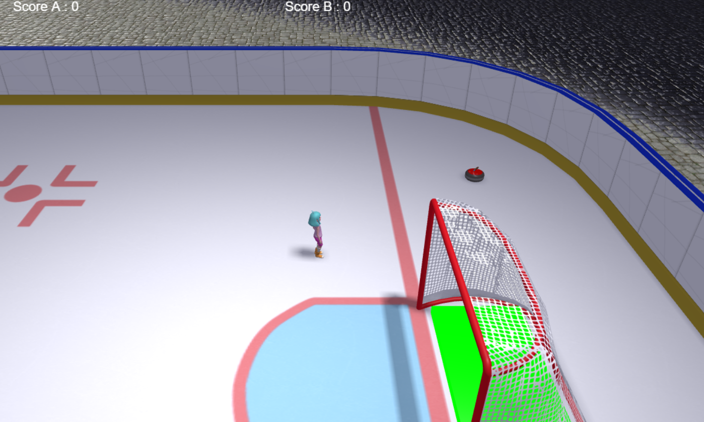

# JeuBabylon: Au Sommet de l'Excellence - Jeux Olympiques en Action

**Développeurs :**
- Filipe PEREDO, MIAGE, Université d'Aix-Marseille, Aix-En-Provence
  - Email : [filipe.peredo@etu.univ-amu.fr](mailto:filipe.peredo@etu.univ-amu.fr)
- BATABA Estassy Marc, MIAGE, Université d'Aix-Marseille, Marseille
  - Email : [marc-estassy.bataba@etu.univ-amu.fr](mailto:marc-estassy.bataba@etu.univ-amu.fr)

## Description du projet
Notre projet, "Au Sommet de l'Excellence: Jeux Olympiques en Action", est un ensemble de deux jeux interactifs développés avec le moteur 3D Babylon.js. Ces jeux sont conçus pour offrir une expérience immersive à travers des simulations sportives utilisant des technologies avancées.

---

### Contrôles des Jeux

#### Premier Jeu: Défis Sportifs Olympiques

Dans ce jeu, les joueurs doivent naviguer à travers différents obstacles pour gagner des points et monter de niveau. Les contrôles sont les suivants :

- **Q** : Déplacement vers la gauche.
- **D** : Déplacement vers la droite.
- **Espace** : Saut.

#### Deuxième Jeu: Soccer - Simulation de Curling avec Physique Avancée

Dans ce jeu, les joueurs contrôlent des pierres de curling pour marquer dans des zones adverses, avec des interactions physiques réalistes. Les contrôles sont les suivants :

- **Z** : Déplacement vers le haut.
- **Q** : Déplacement vers la gauche.
- **D** : Déplacement vers la droite.
- **S** : Déplacement vers le bas.

---

### Comment Lancer le Jeu
**Accédez à notre collection de jeux "Au Sommet de l'Excellence" et jouez directement depuis votre navigateur en cliquant sur le lien suivant :**
- [**Lancer le Jeu**](https://estassy.github.io/JeuBabylon/)

**Profitez de notre plateforme interactive qui vous transporte dans un monde de défis sportifs et de stratégies en simulation de curling.**

---

### Captures d'écran
Pour vous donner un avant-goût de notre expérience interactive, voici quelques captures d'écran de nos jeux :

## Premier Jeu: Défis Sportifs Olympiques

### Description
Le premier jeu met en scène une série de défis sportifs inspirés des Jeux Olympiques, où les joueurs doivent naviguer à travers différents obstacles pour gagner des points et monter de niveau.

### Fonctionnalités
- Plusieurs niveaux avec une augmentation progressive de la difficulté.
- Contrôles intuitifs adaptés à différents types de clavier (AZERTY et QWERTY).
- Effets visuels et sonores pour une expérience immersive.
- Compatible avec la majorité des navigateurs modernes.

### Vidéo de Démonstration
- **Gameplay Complet :** [Voir la vidéo de démo](lien-vers-youtube-premier-jeu)

### Captures d'Écran
 

## Deuxième Jeu: Soccer - Simulation de Curling avec Physique Avancée

### Description
Dans "Soccer: Jeu de Simulation de Curling", exploitez stratégie et précision dans une arène où la physique est au cœur du gameplay. Contrôlez des pierres de curling pour marquer dans des zones adverses, avec des interactions physiques réalistes modulant chaque mouvement.

### Fonctionnalités
- **Scène 3D Immersive** : Profitez d'une simulation réaliste grâce à la gestion avancée de la physique par Havok.
- **Caméra Dynamique** : Suivez l'action de près avec une caméra qui capte chaque détail, assurant une immersion totale.
- **Interactivité Élevée** : Zones de collision et éléments interactifs affectent le score et la dynamique du jeu, offrant des rebondissements constants.
- **Graphismes et Éclairages Avancés** : Des visuels époustouflants et une gestion des lumières sophistiquée pour un rendu visuel captivant.
- **Interface Adaptative** : Une interface qui évolue avec les phases du jeu, intuitive et réactive aux actions du joueur.

### Vidéo de Démonstration
Découvrez "Soccer" en action et voyez comment maîtriser les pierres de curling pour devenir le champion de l'arène :
- [Voir la vidéo de gameplay pour "Soccer"](lien-vers-youtube-deuxieme-jeu)

### Captures d'Écran
 

## Vidéos Bonus
- **Présentation de l'Équipe :** [Voir la vidéo](lien-vers-youtube-presentation)
  - Découvrez les membres de l'équipe, notre démarche de développement et les défis que nous avons rencontrés.
- **Explication Technique :** [Voir la vidéo](lien-vers-youtube-explications)
  - Un regard approfondi sur les techniques et technologies utilisées pour développer ces jeux.

## Repository Externe
Pour un accès complet à tous les fichiers source, veuillez consulter notre repository GitHub externe ici : [Voir le Repository](https://github.com/Estassy/JeuBabylon.git)

## Remarques Importantes
- Aucun fichier volumineux (vidéos, assets de plus de 10 Mo) n'est stocké sur ce repository GitHub conformément aux consignes.
- Assurez-vous d'avoir une connexion internet stable pour une expérience de jeu optimale.

## Feedback
Nous apprécions tous les retours pour améliorer nos jeux. N'hésitez pas à nous envoyer vos commentaires via les issues GitHub ou directement par email à [marc-estassy.bataba@etu.univ-amu.fr](mailto:marc-estassy.bataba@etu.univ-amu.fr).

---

Nous espérons que vous apprécierez jouer à "Au Sommet de l'Excellence" autant que nous avons pris plaisir à le développer !
